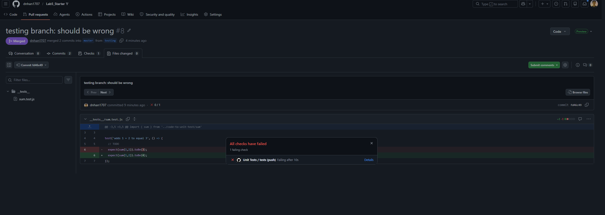
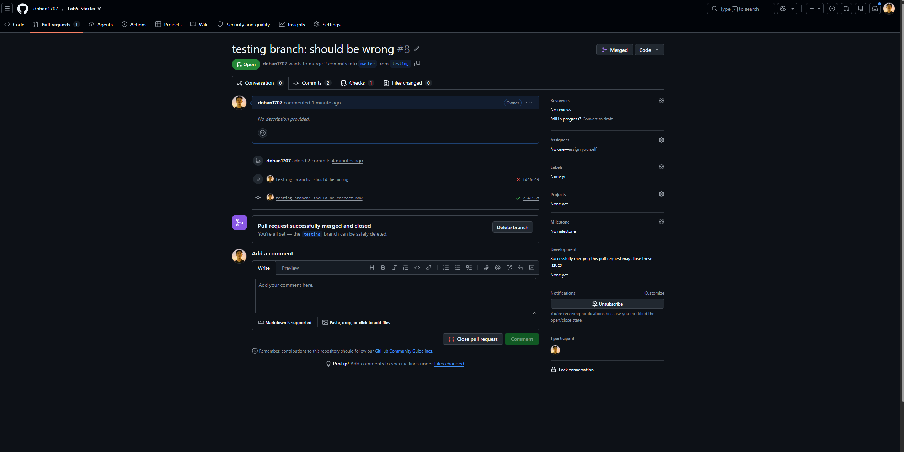

# Lab 5 - Starter
Make sure you make a PR to your own repo's main and not the class' repo!! Otherwise you will lose points!!

**Name:** Nhan Tri Danh

---

## Questions

**1) Would you use a unit test to test the "message" feature of a messaging application?**

No, I would not since the scope is too wide for a unit test. If I wanted to test it, I would test smaller parts such as a function that validates the input message is not empty, a function that formats the message before sending, and a function that updates the UI when a message is received.

**2) Would you use a unit test to test the "max message length" feature of a messaging application?**

Yes, I would since this feature is small and encapsulated enough to test. Intuitively, this can be implemented with a single function only.

---

## Pages
1. Expose: https://dnhan1707.github.io/Lab5_Starter/expose.html
2. Explore: https://dnhan1707.github.io/Lab5_Starter/explore.html

---

## Screenshots
1. `myError.error` with equal 3 instead of 4

2. `merged.correct` after fix
